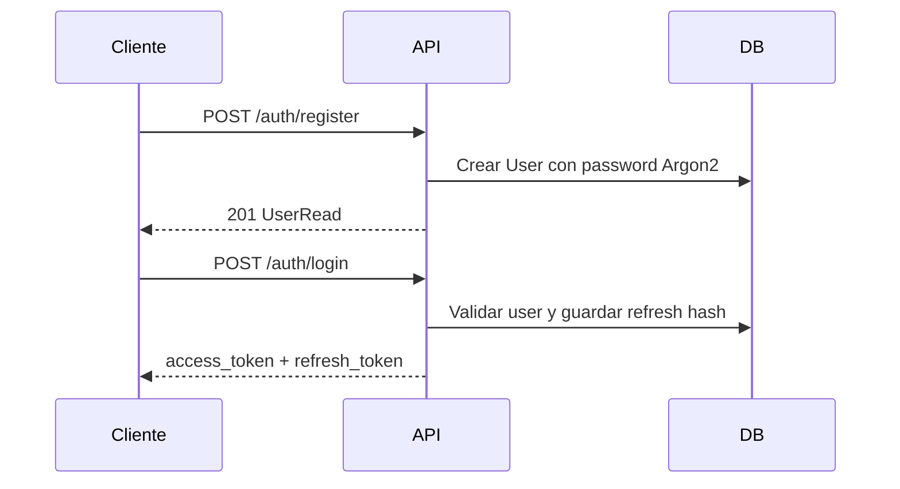
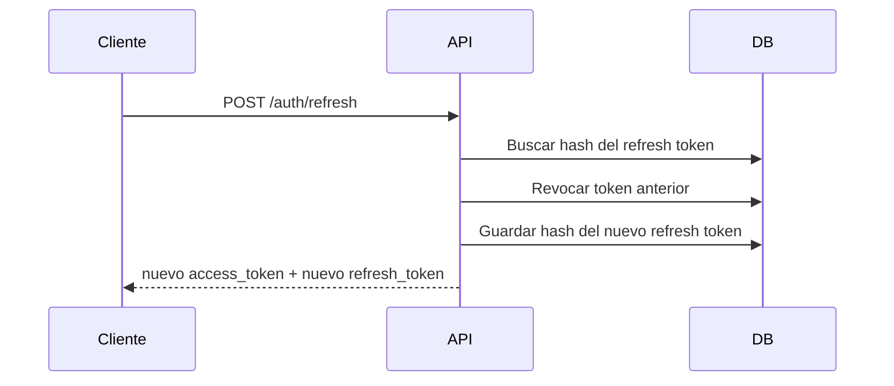
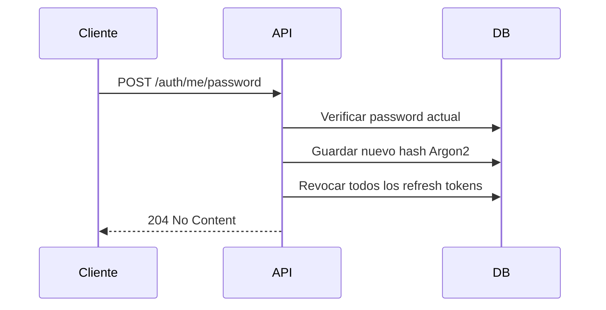

# Demo Server

Servidor FastAPI con modulo de autenticacion JWT, usuarios, refresh tokens rotados,
migraciones y tests unitarios/de integracion.

## Stack

- FastAPI
- SQLAlchemy 2.0 async
- PostgreSQL + asyncpg
- Alembic
- Pydantic v2 + Pydantic Settings
- Passlib + Argon2
- python-jose
- pytest + pytest-asyncio + pytest-cov + httpx
- Docker + Docker Compose
- ruff + mypy

## Caracteristicas

- App factory con health check en `/health`.
- Settings tipados desde `.env`.
- Modelos `User` y `RefreshToken`.
- Repository y service separados.
- Auth con access tokens y refresh tokens.
- Refresh token rotation.
- Refresh tokens guardados hasheados con SHA-256.
- Revocacion de tokens en logout, logout-all y cambio de password.
- Deteccion de reuso de refresh token revocado con revocacion masiva.
- Dependencias `get_current_user`, `get_current_active_user` y `require_role`.
- Error envelope consistente: `{"error": {"code": "...", "message": "..."}}`.

## Decisiones tecnicas

Argon2 se usa para contrasenas porque es resistente a ataques con hardware especializado.
Los refresh tokens se guardan hasheados para no persistir tokens planos. La app usa
SQLAlchemy async y asyncpg para evitar bloquear el servidor en operaciones de base de datos.
Alembic mantiene el schema versionado desde el inicio.

El login usa JSON (`email` + `password`) en lugar de `OAuth2PasswordRequestForm`, porque la API
esta pensada para clientes modernos que consumen JSON. Swagger usa bearer auth para pegar el
access token emitido por `/auth/login`.

## Endpoints

La documentacion interactiva esta en `http://localhost:8000/docs`.

| Metodo | Ruta | Descripcion | Auth |
| --- | --- | --- | --- |
| GET | `/health` | Estado del servicio | Publica |
| POST | `/auth/register` | Crear cuenta de usuario | Publica |
| POST | `/auth/login` | Login con email y password | Publica |
| POST | `/auth/refresh` | Rotar refresh token y emitir nuevo access token | Refresh token |
| POST | `/auth/logout` | Revocar refresh token actual | Refresh token |
| POST | `/auth/logout-all` | Revocar todos los refresh tokens del usuario | Access token |
| GET | `/auth/me` | Leer usuario autenticado | Access token |
| PATCH | `/auth/me` | Actualizar perfil del usuario autenticado | Access token |
| POST | `/auth/me/password` | Cambiar password y revocar refresh tokens | Access token |

## Flujos

Registro y login:



Refresh con rotation:



Cambio de password:



## Security Features

- Argon2 password hashing.
- Access token + refresh token pattern.
- Refresh token rotation.
- Refresh tokens hasheados en base de datos.
- Mensajes genericos en login para evitar user enumeration.
- Revocacion de token individual en logout.
- Revocacion de todos los tokens en logout-all.
- Revocacion de tokens al cambiar password.
- Deteccion de reuso de refresh token revocado con revocacion masiva.
- Jerarquia de roles con `require_role`.
- Rate limiting queda como TODO para una fase posterior.

## Estructura

```text
app/
  main.py
  core/
  auth/
    dependencies.py
    exceptions.py
    models.py
    repository.py
    router.py
    schemas.py
    service.py
  db/
alembic/
  versions/
tests/
  unit/
  integration/
```

## Variables de entorno

Copia `.env.example` a `.env` y ajusta los valores:

```bash
cp .env.example .env
```

En produccion cambia siempre `SECRET_KEY`.

## Ejecucion con Docker

```bash
docker compose up --build -d
docker compose exec app python -m alembic upgrade head
```

La API queda disponible en `http://localhost:8000`.

## Ejecucion local

```bash
python -m venv .venv
.venv\Scripts\activate
pip install -e ".[dev]"
copy .env.example .env
alembic upgrade head
uvicorn app.main:app --reload
```

## Migraciones

```bash
alembic upgrade head
alembic revision --autogenerate -m "message"
```

## Tests y calidad

```bash
pytest
pytest --cov=app --cov-report=term-missing --cov-fail-under=80
ruff check .
mypy app/
```

## Roadmap

- Rate limiting para endpoints sensibles.
- Password reset por email.
- Email verification.
- 2FA/MFA.
- OAuth2 social login.
- Endpoints admin para gestion de usuarios.
